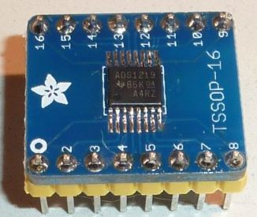

# MicroPython Driver for Texas Instruments ADS1219 Analog to Digital Converter (ADC)

The ADS1219 is a precision, 4-channel, 24-bit, analog-to-digital converter (ADC) with I2C interface

# class ADS1219

**Example usage - single shot conversion with 3.3V external reference**

```
from machine import I2C
from ads1219 import ADS1219
import utime

i2c = I2C(scl=machine.Pin(5), sda=machine.Pin(4))
adc = ADS1219(i2c)

adc.set_channel(ADS1219.CHANNEL_AIN0)
adc.set_conversion_mode(ADS1219.CM_SINGLE)
adc.set_vref(ADS1219.VREF_EXTERNAL)

while True:
    result = adc.read_data()
    print('raw = {}, mV = {}'.format(result, result*3.3*1000/(2**23)))
    utime.sleep(0.25)      
```
***

## Constructor
```
class ads1219.ADS1219(i2c, [address = 0x040]),
```
Construct and return a new ADS1219 object with the given arguments:
  * **i2c** specifies I2C bus instance
  * **address** device address
  
Defaults after initialization:
  * channel = CHANNEL_AIN0_AIN1
  * gain = 1
  * data rate = 20 SPS
  * conversion mode = single-shot
  * voltage reference = internal 2.048V

## Methods
```
ADS1219.read_config()
```
Read the contents of the 8-bit Configuration Register

***  
```
ADS1219.read_status()
```
Read the contents of the 8-bit Status Register

***
```
ADS1219.set_channel(channel)
```
***
```
ADS1219.set_gain(gain)
```
***
```
ADS1219.set_data_rate(data_rate)
```
***
```
ADS1219.set_conversion_mode(conversion_mode)
```
***
```
ADS1219.set_vref(voltage_reference)
```
***
```
ADS1219.read_data()
```
Read the most recent conversion result
***
```
ADS1219.reset()
```
Resets the device to the default states
***
```
ADS1219.start_sync()
```
Starts a conversion.  start\_sync() must be called to start continuous conversion mode.  Not needed for single-shot conversion
(the read\_data() method includes a start\_sync() call for single-shot mode)
***
```
ADS1219.powerdown()
```
Places the device into power-down mode
***

## Constants

**channel(s)** being sampled

```
CHANNEL_AIN0_AIN1 
CHANNEL_AIN2_AIN3
CHANNEL_AIN1_AIN2
CHANNEL_AIN0
CHANNEL_AIN1
CHANNEL_AIN2
CHANNEL_AIN3
CHANNEL_MID_AVDD
```
***

**gain**

```
GAIN_1X, GAIN_4X
```
***

**data_rate**

```
DR_20_SPS, DR_90_SPS, DR_330_SPS, DR_1000_SPS
```
***

**conversion_mode**

```
CM_SINGLE, CM_CONTINUOUS
```
***

**voltage_reference**

```
VREF_INTERNAL, VREF_EXTERNAL
```
## Making a breakout board
The ADS1219 device is available in a TSSOP-16 package which can be soldered onto a compatible breakout board.  Here is a photo showing the device soldered into an Adafruit TSSOP-16 breakout board.



[Adafruit TSSOP-16 breakout board](https://www.adafruit.com/product/1207)

The ADS1219 device can be purchased from a supplier such as Digikey.  In single quantities each part costs around USD $6.50.  Make sure to purchase the TSSOP-16 package and not the WQFN-16 package (which is more difficult to hand solder).

[ADS1219 in TSSOP-16 package](https://www.digikey.com/product-detail/en/texas-instruments/ADS1219IPWR/296-50884-1-ND/9743261)
